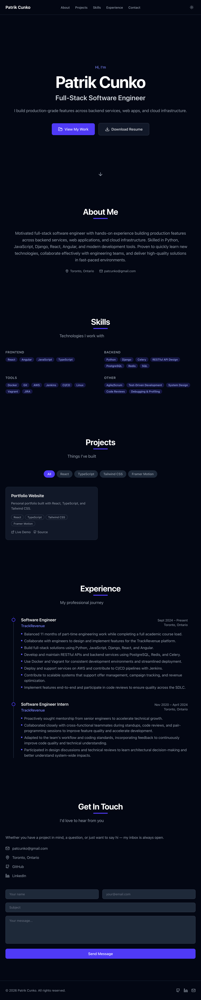

# Patrik Cunko — Portfolio Website

**Live site:** https://patrikcunko.com

A personal portfolio website showcasing my projects, skills, and professional experience. Built with modern web technologies and a focus on performance, accessibility, and clean design.



---

## Features

- **Responsive design** — fully optimized for desktop, tablet, and mobile
- **Dark / light mode** — persisted to `localStorage`, respects system preference on first visit
- **Smooth scroll navigation** — active section highlighted in the navbar via scroll spy
- **Animated sections** — scroll-triggered entrance animations powered by Framer Motion
- **Project showcase** — filterable project grid with live demo and source code links
- **Contact form** — validated with Zod + React Hook Form, submitted via Formspree
- **Resume download** — one-click PDF download from the hero section

---

## Tech Stack

| Category | Technology |
|---|---|
| Framework | React 19 + TypeScript |
| Build Tool | Vite 8 |
| Styling | Tailwind CSS v4 |
| Routing | React Router v7 |
| Animations | Framer Motion |
| Forms | React Hook Form + Zod |
| Icons | Lucide React |
| Linting | ESLint + Prettier |

---

## Project Structure

```
src/
├── assets/             # Images and icons
├── components/
│   ├── layout/         # Navbar, Footer, Layout shell
│   └── ui/             # Reusable primitives (Button, Card, Badge, etc.)
├── context/            # ThemeContext (dark/light mode)
├── data/               # Static content — personal info, projects, skills, experience
├── hooks/              # useScrollSpy, useInView
├── pages/              # Home, ProjectDetail, NotFound
├── router/             # React Router configuration
├── sections/           # Page sections — Hero, About, Skills, Projects, Experience, Contact
├── types/              # TypeScript interfaces
└── utils/              # cn() utility (clsx + tailwind-merge)
```

---

## Getting Started

### Prerequisites

- Node.js v18+
- npm v9+

### Installation

```bash
# Clone the repository
git clone https://github.com/patcunko/portfolio-website.git
cd portfolio-website

# Install dependencies
npm install

# Start the development server (opens browser automatically)
npm run dev
```

### Other Commands

```bash
npm run build      # Production build
npm run preview    # Preview the production build locally
npm run lint       # Run ESLint
```

---

## Customization

All personal content lives in [`src/data/`](src/data/) — no need to touch component code to update your info.

| File | What to update |
|---|---|
| [`src/data/personal.ts`](src/data/personal.ts) | Name, title, bio, email, social links |
| [`src/data/projects.ts`](src/data/projects.ts) | Project entries |
| [`src/data/skills.ts`](src/data/skills.ts) | Skills and categories |
| [`src/data/experience.ts`](src/data/experience.ts) | Work history |
| [`src/data/education.ts`](src/data/education.ts) | Education |
| [`public/resume.pdf`](public/resume.pdf) | Downloadable resume |

### Contact Form

The contact form submits to [Formspree](https://formspree.io). Replace the endpoint in [`src/sections/Contact/ContactForm.tsx`](src/sections/Contact/ContactForm.tsx):

```ts
const response = await fetch('https://formspree.io/f/YOUR_FORM_ID', { ... })
```

---

## Deployment

This is a static site and can be deployed to any static hosting provider.

**Recommended: [Vercel](https://vercel.com)**

```bash
# Install Vercel CLI
npm i -g vercel

# Deploy
vercel
```

Or connect your GitHub repository to Vercel for automatic deployments on every push to `main`.

---

## License

MIT — feel free to use this as a template for your own portfolio.

---

> **Note:** To add a preview screenshot, take a screenshot of the live site and save it to `docs/preview.png`.
